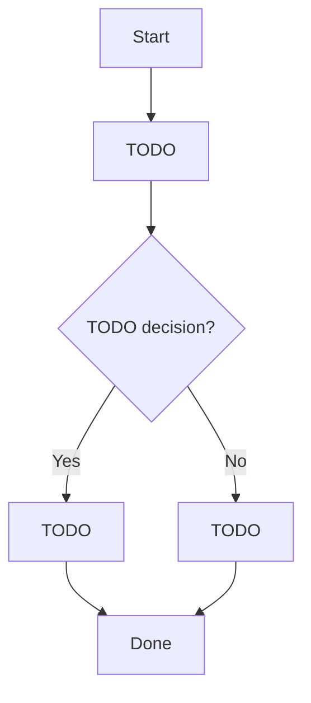

# Feature Workflow Contract

Feature: TODO
Owner or source of agreement: TODO
Last updated: TODO

## Goal

TODO

## User-Visible Promise

TODO

## Entry Points

- TODO

## Preconditions

- TODO

## Workflow

## Required Order

1. TODO
2. TODO
3. TODO

## Branches And States

- TODO

## Blocking And Background Work

- Blocks user interaction: TODO
- Must not block user interaction: TODO
- Background work: TODO

## Loading And Empty States

- TODO

## Failure, Retry, And Cancellation

- TODO

## Data And Freshness Rules

- TODO

## Observability

- User-visible errors: TODO
- Logs or metrics: TODO

## Verification

- Happy path: TODO
- Branches: TODO
- Slow or failed dependencies: TODO
- Ordering guarantees: TODO
- Regression areas: TODO

## Open Questions

- TODO
